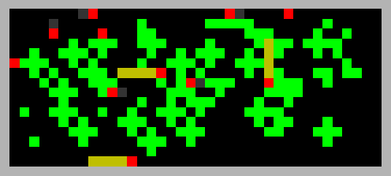

This is an OpenAI gym implementation of the Commons Game, a multi-agent environment proposed in [A multi-agent reinforcement learning model of common-pool resource appropriation](https://arxiv.org/abs/1707.06600) using [pycolab](https://github.com/deepmind/pycolab) as game engine.

## Requirements

To install known dependencies `cd` to the directory of the repository and run `pip install -r requirements.txt`

## Usage

The file `example.py` contains a simple usage example where you can modify the number of agents and the size of its field of vision. To run the example `cd` to the directory of the repository and run `python example.py`. You should see something like this:

